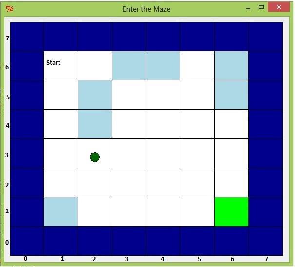
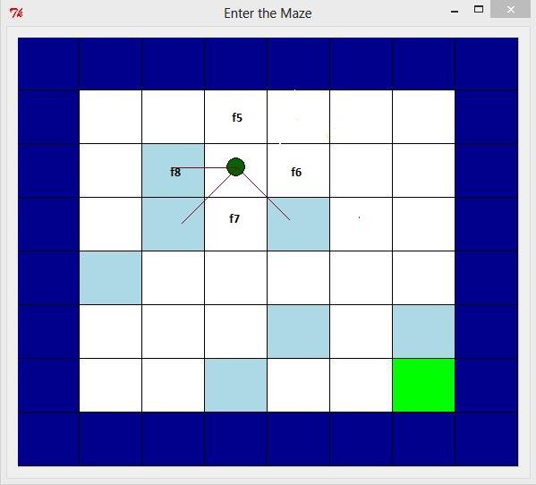
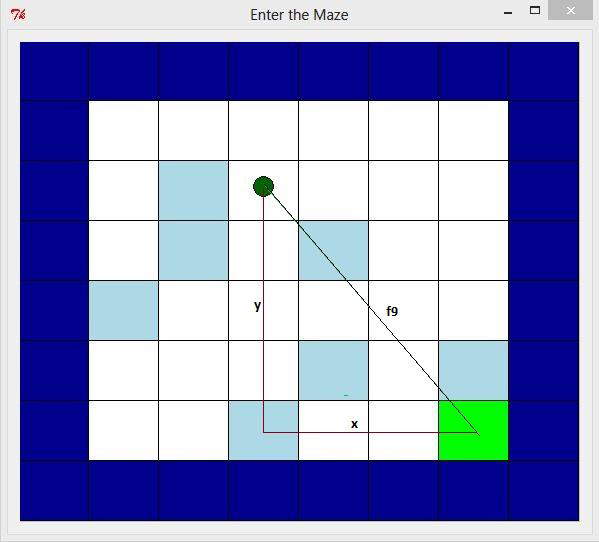

# Apprenticeship Learning – Finding the optimal path

Apprenticeship learning or behavioural cloning is the process by which an agent learns how
to act by observing how other agents are acting in a given environment. In this assignment
you are going to use this approach to train an agent that learns how to navigate optimally in
a non-deterministic environment by observing the behaviour of expert learners.

The setup for the environment is as follows:


*Figure 1 Representation of an agent navigating through a maze*

Each block has a reward associated with it. The goal of the agent is to maximize the sum of
its rewards.


* The dark blue regions have a reward of - 10
* The light blue regions have a reward of - 5
* The green region has a reward of +
* The green circle denotes where the agent is in the grid
* Each move from one white block to the next has a reward of - 1
* When the agent attempts to move in a particular direction, it moves in its intended
direction with a probability of 70%, otherwise it moves in the directions
perpendicular to it with the remaining 30% probability.

If the agent lands on any of the coloured (non-white) blocks, then it cannot move further as
these are the terminal states. At this point the agent would collect the sum of its rewards
(the very thing the agent is trying to maximize).


You can assume that the grid is (8 x 8), with the starting point as (6, 1) as shown in Figure
1 The green and the dark blue blocks are always fixed as shown, but the position (and
number) of the light blue blocks can vary from one training example to the next.

Your training set consists of various grids and the optimal policies for these grids. Therefore
each training example is a list of 2 elements. The first element is a 2D array representing a
grid. The array has values 0 – white block, 1 – light blue block, 2 – dark blue block and 3 –
green block. The second element is a dictionary where the key is a single grid square (x, y),
and the value is the direction the optimal agent would move from that position, 0 – North, 1- East, 2 – South, 3 – West. You may load the training set as follows:
``` python
dataset = pickle.load(open('training_data.p', 'rb'))

dataset[i] # this is the ith training example

dataset[i][0] # this is the grid for the ith training example

dataset[i][1] # this is the optimal policy for the ith training example
```

The goal of this assignment is to model an agent that can (at any state) make an optimal
decision about which direction to move in.

# _(a) Feature extraction_

Your first task is to extract a set of features from any given grid.

**_(i)_** Assume the agent has sensors that allow it to detect how far it is from the dark blue
squares as shown in Figure 2.2. The first set of features you will extract are the distances
from the agent’s location to the dark blue squares. In this figure you will notice that the
values for these features are [f1=2, f2=4, f3=5, f4=3]. You will write your code for extracting
these features in the function _feature_set_1._ Your function should return a list of these
features in the order f1, f2, f3, f4 (See the skeleton function _feature_set_1_ for more details).


*Figure 2.1 Distances between the agent and the dark blue squares in the four major
directions around it (f1=2, f2=4, f3=5, f4=3).*

**_(ii)_** Assume the agent also has sensors that allow it to detect the number of light blue squares
that are in the four major directions around it as shown in Figure 2.3. You will extract these
second set of features by taking f5 to be the total number of light blue squares in the
directions NW, N and NE from the agent, f6 as the total number of light blue squares in the
directions NE, E, and SE, f7 as the total number of light blue squares in the directions SE, S
and SW and finally f8 is the total number of light blue squares in the directions SW, W and
NW. Therefore the values for these features in Figure 2.3 are [f5=0, f6=1, f7=2, f8=2] and
should be returned as a list. You should write your code for this section in the function
_feature_set_2.


*Figure 2.2 Total number of light blue squares surrounding the agent. Here f5=0, f6=1, f7=2,
and f8=2.*

iii) For the final feature, we are going to assume that the agent has a sensor that allows it to
detect its Euclidean distance to the green square. This distance is the feature f9 shown in
Figure 2.4 where f9 = sqrt(y^2 + x^2 ) , y is the vertical distance that you have to move to reach
the goal and x is the horizontal distance that you have to move to reach the goal. In Figure
2.4, y=4 and x=3. You should write your code for extracting this feature in the function
_feature_set_3.


*Figure 2.4 Euclidean distance of the agent from the green square. Here x=3, y=4 and
therefore f9=5*

# _(b) Learning and Policy checking_

Your next step is to train your model using the features that you defined in the previous part
(therefore your model will have 9 features). You will use _scikit-learn_ to train your model.
While training your model, only extract features for points (1, 1) up to (6, 6) for any given
grid. Do not extract features for points that lie on the dark blue region of the grid such as (0,
p), (p, 0), (7, p), (p, 7) where 0<=p<=7 (cf. Figure 2.1 for the indices of the cells). Make sure
you standardize these features using _scikit-learn_ ’s _StandardScaler_. You will train a support
vector machine with a _Radial Basis Function (rbf)_ kernel and the parameters C=1 and
random_state=0. You should write your code in the script _learning_phase.py._

Now, using the model that you trained, the next step is to evaluate how well it did. You will
write a function _evaluate_model_ within the same script, that takes a 2D array representing a
grid and returns a dictionary of what actions to take from the states (1, 1) up to (6, 6).
Therefore the dictionary you return should have a state (x, y) as its key, and the direction to


move from that state (0, 1, 2, or 3, where these numbers denote the following directions: 0 –
North, 1 – East, 2 – South, 3 – West) as its value.

# _(c) Build your own model

You may now disregard any assumptions that we made earlier on about what the agent
knows about its environment. Make your own assumptions and extract features that would
improve how well your model performs. You will write your code in the script
_custom_model.py_ and within this script you should have a function called _evaluate_model_
that takes a 2D array representing a grid and returns a dictionary of what actions to take
from the states (1, 1) up to (6, 6) just as the previous part. To help you determine how well
your model is doing, we have provided you with a small test set that you can use.


```Note

To visualize how your model is doing, we have provided you with a GUI that shows the path
taken by the agent. It takes as inputs a grid and its policy, and you may make a call to this
function from the script _visualise.py_. An example call to this interface is shown below:
```
``` python
dataset = pickle.load(open('training_data.p', 'rb'))

sample_grid=dataset[0][0]

sample_policy=dataset[0][1]

move_on_grid(sample_grid, sample_policy)
```

# _Files included in this assignment

*_feature_extraction.py_*-- script for extracting features from your model.

*_learning_phase.py_* -- script for training and evaluating your model.

*_visualise.py_* – script for visualising the path taken by an agent.

*_custom_model.py_* – script for training and evaluating your own model.

*_grid_implementation.py_* – (supporting file) you may ignore this script.

*_RL_model.py_* – (supporting file) you may ignore this script.

*_training_data.p_* -- file containing training examples.

*_test_data.p_* -- file containing test examples.


