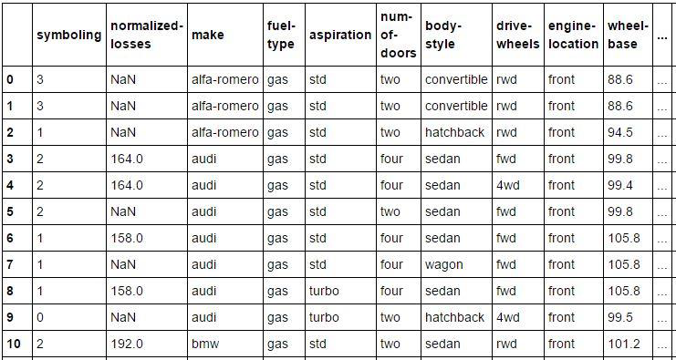

# Data preprocessing with scikit-learn

One of the keys that determine how well a machine learning algorithm can learn is the
quality of data and the amount of useful information it contains. In this project we will
explore various data preprocessing techniques that will be useful in building good machine
learning models.

You have been provided with a dataset that contains different characteristics of various cars
and their associated insurance risk rating. This dataset has a total of 26 features, although
some instances of these features have missing values. You will find the labels for these
features in the file ‘ _feature_labels.txt_ ’ and the corresponding feature values in the file
‘ _dataset.txt_ ’. The missing values are denoted by the ‘?’ symbol. You have also been provided
with a python script ‘ _main_script.py_ ’, which is where you will write all your code.

For sections **(a)** to **(g)** you should save your results in the variables specified in
_main_script.py_ so that we can autograde your work.

**(a)**
Your first task is to generate a data frame from the dataset we provided you using the
pandas module. Your data frame should be similar to the one shown in Figure 3.1 below,
where missing values are represented by NaN.


*Figure 1 shows data Frame illustrating some instances from our dataset*

You should return the number of missing values for every feature "as a python list". For
instance, in Figure 3.1 symboling has zero missing values, normalized-losses has six missing
values and so forth, therefore the list returned should be [0, 6, 0, 0, ...]. Save your list in the
variable “ _missing_features_ ”.

**(b)** Your next task is to fill in the values for the missing features, but in order to do that you
will first find the averages for every feature that has missing values. The averaging methods
we will use for this section are the mode, the median and the mean.

You will find the mode for the following features:


_num-of-doors_

You will find the mean for the following features:

_normalized-losses, price, bore, stroke_

You will find the median for the following features:

_horsepower, peak-rpm_

After finding these different averages you should now modify your data frame by replacing
the missing values with the corresponding averages you calculated above. Save your data
frame after making these changes in the variable df_b.

**(c)** Map the values of the ordinal features _num-of-doors_ and _num-of-cylinders_ with their
integer representation. For instance, if the value of the feature is ‘eight’, replace this word
representation with the corresponding integer 8. Save your data frame after making these
changes in the variable df_c. –

**(d)** Identify the nominal features in your dataset and perform one-hot encoding on these
features. For example, the feature fuel-type will be transformed to the features fuel-
type_gas and fuel-type_diesel. Modify your data frame and replace its nominal features with
their one-hot encoding representation and save it to the variable df_d.

```Note:

Be careful when saving your data frames to the variables df_b, df_c, and df_d. Make sure
these variables are not referencing the same data frame object. For instance the variable
df_b should only reflect the changes in your data frame after the tasks in section **(b)** have
been completed, and it should not be modified after the tasks in sections **(c)** and **(d)** have
been completed. The variable df_c should reflect the changes after the tasks in sections **(b)**
and **(c)** have been completed and finally the variable df_d should reflect the changes after
the tasks in sections **(b)**, **(c)** and **(d)** have been completed.
```
**(e)** The label ‘ _symboling_ ’ from our dataset represents the insurance risk rating for every
automobile where +3 indicates that the car is very risky and -3 indicates that it is pretty safe.
We will use this label as the class label we wish to predict. Using the method _train_test_split_
from _scikit-learn_ , partition the dataset into a training and a test set, with the parameters
_random_state_ = 0 and _test_size_ = 0.3. After that, train a decision tree classifier with
maximum depth of 20, random_state of 0 and ‘entropy’ as the measure for information gain.
Find the accuracy on the training and the test set and save them to the varibles
training_accuracy and test_accuracy.

**(f)** For this section you will build a random forest with the goal of assessing feature
importance. Train a random forest classifier with the parameters _n_estimators_ = 10,
_random_state_ = 0 and _max_depth_ =20. Use this forest to assess how much each feature
contributes to the model, and return a list of tuples where each tuple comprises of a feature
label and its contribution score. Save this list of tuples in the variable feature_importance.


**(g)** You will now train multiple decision trees using various number of features and the same
parameters as in part **(e)**. You will first train a decision tree with the most important feature
and record its (test) accuracy, then train it with the first two important features and record
that accuracy, then the first three important features, until you have exhausted all the
features. You will then plot a line graph with accuracy on the vertical axis and the number of
features on the horizontal axis (if we call the function _visualise_line_graph_ it should generate
this plot). Finally, find the number of features that produce the highest accuracy. Save this
result in the variable num_of_features.

**(h)** For this section you will write a function called _custom_model_prediction_ (see
_main_script.py_ ). This function will take a text file as an input, and this text file represents a
test set. This text file will have the same format as the original _dataset.txt_ file except that the
symboling (the class label) column will be removed. It may also have some missing values for
some features (in this case _num-of-doors, normalized-losses, price, bore, stroke, horsepower,
peak-rpm_ ), so you must also handle those in any way you see fit. The file _sample_test.txt_
shows the format of this file and contains only 2 instances, but we will test your program
with any number of instances so you should take that into account. You are free to use any
classifier and any feature extraction methods of your choice. This function should just return
predictions (as a list) of every instance in the test set.
