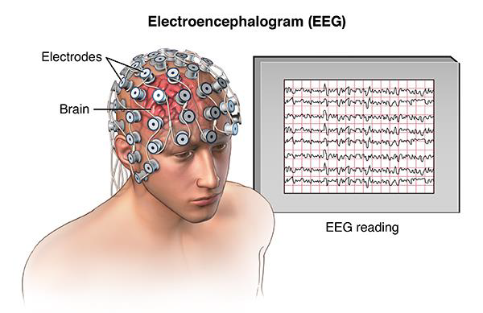
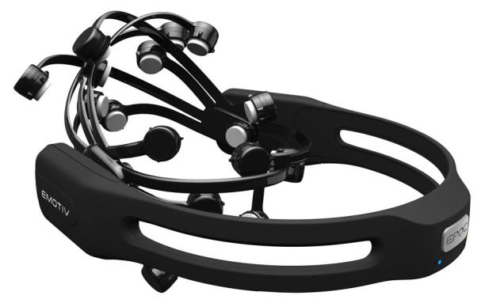
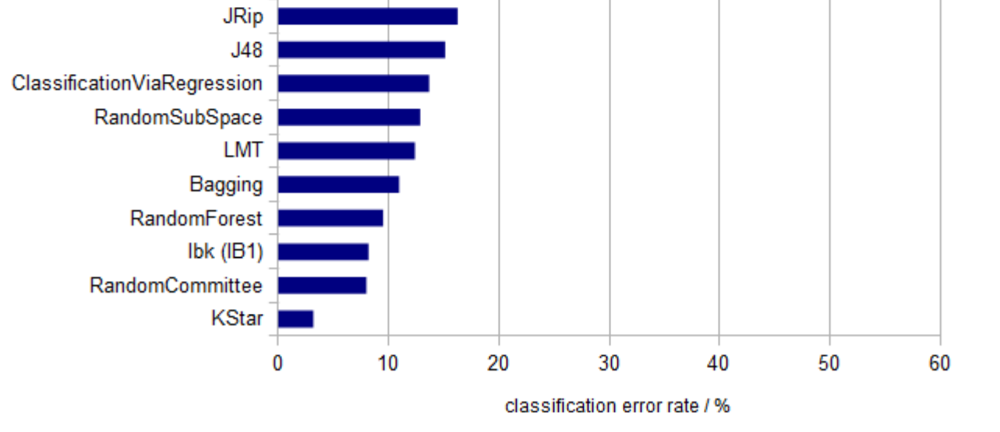
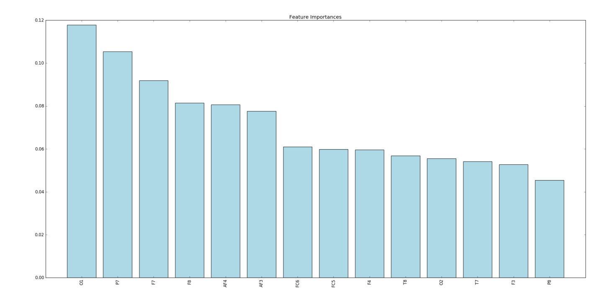

# Eye State Prediction Project Results Report

## Contents

- 1. Overview
- 2. Dataset
- 3. Prediction Models
- 4. Accuracies
- 5. Comparison to literature
- 6. Conclusion and Results
- 7. Future Discussion

## _Overview:_

In this project, machine learning techniques are used to predict the eye state of a
human being; whether if his eyes are open or closed. Brain electrical signal are recorded using a
biomedical device called: EEG which stands for “Electroencephalography”.
Electroencephalography (EEG), as shown in figure1, is an electrophysiological monitoring
method to record electrical activity of the brain. It is typically noninvasive, with the electrodes
placed along the scalp, although invasive electrodes are sometimes used in specific
applications.

EEG measures voltage fluctuations resulting from ionic current within the neurons of the brain.
In clinical contexts, EEG refers to the recording of the brain's spontaneous electrical activity
over a period of time, as recorded from multiple electrodes placed on the scalp. Diagnostic
applications generally focus on the spectral content of EEG, that is, the type of neural
oscillations (popularly called "brain waves") that can be observed in EEG signals as shown in
figure 1.

*Figure 1*

After obtaining the dataset from this device, signal processing techniques are applied then
machine learning to predict the state of the human eye. Various machine learning algorithms
are used with various accuracies predictions.

## _Dataset:_

The data set consists of 14 EEG values and a value indicating the eye state. The following
table illustrates and gives an insight on the dataset that we have:

*Figure 2*

This dataset is preprocessed and ready for classification. So, we _do not need any preprocessing
or feature extraction_. All data is from one continuous EEG measurement with the Emotiv EEG
Neuroheadset shown in figure 3. The duration
of the measurement was 117 seconds. The
eye state was detected via a camera during
the EEG measurement and added later
manually to the file after analyzing the video
frames. '1' indicates the eye-closed and '0' the
eye-open state. All values are in chronological
order with the first measured value at the top
of the data.

*Figure 3*

Dataset contains 14980 samples, 14 features*, and one binary label. Data is divided 70% for
training and 30% for testing.

Feature standardization is used using Sikitlearn library in python to scale and normalize the
feature samples. Then the data is fed to the various model predictions that are used.

> features are the signals from the 14 electrodes: 'AF3','F7','F3','FC5','T7','P7','O1','O2','P8','T8','FC6','F4','F8','AF4'

## _Prediction Models:_

So many algorithms are used in machine learning as a prediction models. To pick a good
model that fits your data is not an easy task. In this project, we have tried different models, and
obtained different accuracies.

  **_Supported Vector Machine (SVM)_**

The first model that we used is Supported Vector Machine (SVM) with radial basis function,
with the following parameters: kernel='rbf', random_state=0, C=1.

  **_Decision Tree_**

The second model that we used is Supported Vector Machine (SVM) with radial basis function,
with the following parameters: criterion='entropy', max_depth=40, random_state=0.

  **_Neural Network_**

The third model that we used is NN, but it is discarded from the code lines because of the very
bad accuracy even with hyper parameters variations. This model gave a very bad accuracy after
several tries tuning the parameters.

  **_Random Forests_**

The fourth model that we used is Random Forests, which gave the higher accuracy of all the
previous models. The used parameters are: n_estimators=1000,random_state=

## _Accuracies:_

The accuracies for the above prediction models are collected in the following table:

*Figure 4*

As shown in the table, SVM has the lowest accuracy, while Random Forests has the higher
accuracy.

## _Comparison:_

To compare my model with other proposed models in literature that used the same dataset, I
have searched in literature for a paper until I’ve found a paper that used the same data. This
paper has the title: A First Step towards Eye State Prediction Using EEG by Oliver Rosler and
David Suendermann. They have used various models to estimate the best accuracy. I have
scored almost the same accuracy as them. As seen in figure 5 (from the paper):

*Figure 5*

## _Conclusion and Results:_

Accordin the random forests, the future importances are represented in the following figure 6:

*Figure 6*

In conclusion, our model fits the data as the literature paper. We got the same accuracy with
random forests,

## _Future Discussion:_

In the future, we may record more signals from more electrodes that those 14 electrodes. We
can also try to you deep network or deep learning techniques. Also we can reprocess the
feature signals after extracting it from the electrodes and sample it with different sampling than
this dataset.

On important thing is to find an application for this eye state. We can use it automotive cars to
detect the human eye if it closed then it stops the car, because sometimes when people driving
they fall asleep and this could cause serious accidents.

We can also use this technique for the locked-in syndrome patients. Those people can’t speak
or move anything but their eyes. Somehow we can detect their eyes if it is open or closed and
relate this eye state to mobile phone for emergencies or sending messages after a certain
sequence of open/closed eyes which is at the end a certain sequence of binary data.

