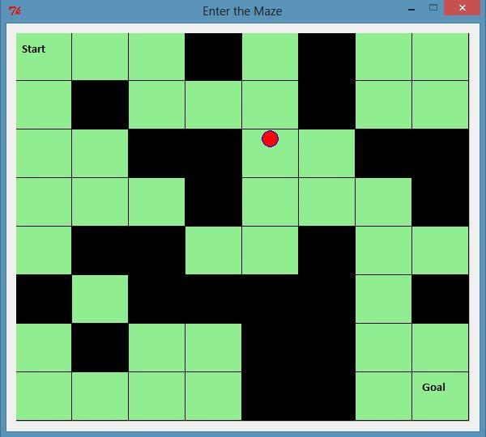
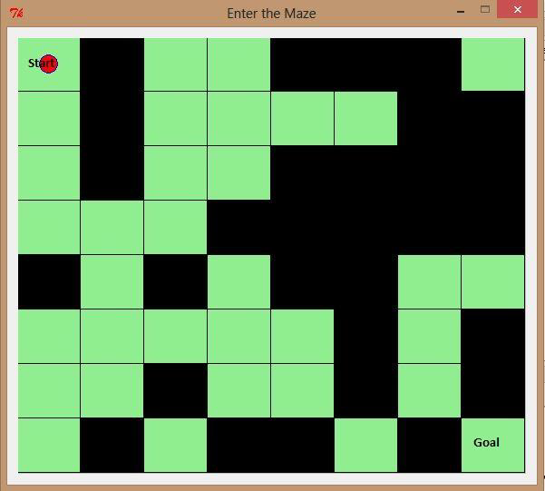

# Perceptron Learning – Path Finding – Is there a path?

Traditionally when we are faced with the task of determining whether a given maze has a
path or not we resort to various search or path finding algorithms which are able to answer
this question with absolute certainty. In this assignment, however, we will take a different
approach to solve this problem by building a classifier that determines (to a certain degree)
whether a given maze has a path or not.

**Files included in this work**

**_perceptron_classifier.py_** -- implementation of the perceptron classifier (from the textbook).

**_feature_extraction.py_** -- script for extracting features from any given maze.

**_training_phase.py_** -- script for training your model.

**_model_evaluation.py_** – script for evaluating how well your model did.

**_training_set_positives.p_** -- contains 150 mazes that have a path. Each training example in
this file has a label of +1.

**_training_set_negatives.p_** -- contains 150 mazes that do not have a path. Each training
example in this file has a label of - 1.

**_test_set_negatives.p_** -- contains mazes that do not have a path. You will use these to
evaluate your model.

**_test_set_positives.p_** -- contains mazes that do have a path. You will also use these to
evaluate your model.

> (Note:
All files with a (.p) extension are in pickle format. Details on how to open these files will be
provided below.)

The setup for this problem is as follows:

* Your training set has 300 mazes in total
* Each training example is a 2 dimensional array where the green squares are
represented as zeros and the black squares are represented as ones (see the figures
below). For instance, the first three rows of the maze in Figure 1.1 are represented by
the following array, [ [0,0,0,1,0,1,0,0], [0,1,0,0,0,1,0,0], [0,0,1,1,0,0,1,1], ...]
* Your training set consists of two dictionaries (one for the positive examples and the
other for the negative examples) that have these 2 dimensional arrays as their
values.

In order to open the files which are stored in pickle format, you will use the pickle module as
follows:
```python
import cPickle as pickle

train_positives = pickle.load(open('training_set_positives.p', 'rb'))
#train_positives is a dictionary with the training examples that have a path
```

The same logic can be applied to the negative examples as well.

Below is visualized instance of your training set.

  

(Figure 1.1 shows an instance where there is a path from start to goal. Figure 1.2 shows an
instance where a path from start to goal does not exist. The red circle denotes where you
are in the maze.)

**(a) Feature Extraction**

Your first task is to extract two features from the given dataset. You have been provided
with the python script _feature_extraction.py_ and within this script you have two skeleton
functions defined for you.

The first feature you will compute is the proportion of black squares to the total number of
squares in the grid. You will write your code for extracting this feature within the function
_feature 1 (x)_. If the input to your function is the maze in Figure 1.1 then the feature value that
should be returned for that maze is 24/64 = 0.375.

The second feature you will compute is the sum over all the rows of the maximum number
of continuous black squares in each row. You will write your code for extracting this feature
within the function _feature2(x)_. In Figure 1.1 the maximum number of continuous black
squares in the first row (from the top) is 1, in the second row 1, in the third row 2, and in the
sixth row 4 , etc. The value of this feature for this example is therefore the sum of these
values, i.e., 1+1+2+1+2+4+2+2 = 15.

**(b) Visualising Features – 15 points**


After writing your functions for extracting features, you will now visualize your training set
using those features. This means you should extract these features from every training
example. You should write your code in in the script _training_phase.py._ If we make a call to
the function _visualise_features_ we should be able to see a plot similar to Figure 1.3 below.

Below is a scatter plot for our training set.

**Figure 1.3 Distribution of the features for every maze in the training set**

**(c) Perceptron Classifier - Training – 3 0 points**

As you can see from Figure 1.3, the data is not linearly separable. Hence, simply using the
vanilla perceptron algorithm to classify this data will lead to unpredictable behaviour (Try
it!). This is due to the fact that the perceptron returns the most recent version of the weight
vector which is well adapted to the latest instances it encountered but may not generalize
well to other (earlier) instances. You have been provided with an implementation of the
perceptron classifier from your textbook. You are going to modify this algorithm, and
implement the averaged perceptron classifier. The motivation behind implementing this
classifier is to average all the weights seen so far and generate weight vectors that are well
adapted to the training set as a whole. The way it works is as follows:

Assume we have a training set of size _m_ and that we are running our algorithm for _n_
iterations. We can view each version of the weight vector as a separate classifier, i.e., we
have _mn_ classifiers. The most intuitive way of implementing this algorithm would be to store
each weight vector _Wi_ and average them to get our averaged weight vector Wavg as follows:

```
푊푎푣푔=
```
### (푊 0 + 푊 1 + ...+ 푊푚푛)

### 푚푛


However, this approach is too impractical because it requires storing _mn_ weight vectors
which is a waste of memory.

A better approach would be to update our weight vector by using a running average where
the vector _Wi_ is the sum of all updates so far. For instance, if we wanted to compute the
average of the vectors _W 1_ , _W 2_ , and _W 3_ we would do it as shown below:

```
W 0 = (0, 0, ... , 0)
```
```
W 1 = W 0 + ∆ 1 = ∆ 1
```
```
W 2 = W 1 + ∆ 2 = ∆ 1 +∆ 2
```
```
W 3 = W 2 + ∆ 3 = ∆ 1 + ∆ 2 + ∆ 3
```
```
Wavg = ( W 1 + W 2 + W 3 )/3 = (3/3) ∆ 1 + (2/3) ∆ 2 + (1/3) ∆ 3
```
## Here ∆j is defined as η*(y(i) – ӯ(i))xj(i) (the perceptron update rule from your book) where

## y(i) is the actual label of the ith training example, ӯ(i) is the predicted label of the ith training

## example and xj(i) is the jth feature of the ith training example. W 1 corresponds to the weight

learned after the first iteration of the first training example, _W 2_ corresponds to the weight
learned after the first iteration of the second training example, and so forth. Modify the
perceptron algorithm and implement the averaged perceptron classifier using the weight
update rule above. Make sure to shuffle the training samples at every iteration.

Using the classifier that you built, you are now going to train your data for 1 000 iterations
with a learning rate η = 0.1. Please make sure that the function _train_classifier_ returns the
averaged weights learned by your perceptron classifier and these weights should have the
same format as _self.w__ in _perceptron_classifier.py_. Also make sure to save your weights
before returning them (you may write them to a text file), as you will need them later on.

**(d) Visualising the decision boundary – 15 points**

Now using the weights that you learned, you will plot a decision boundary on your dataset,
and generate a plot like the one shown in Figure 1.4 (The colouring scheme is not necessary,
we should just be able to distinguish the positive examples from the negative ones). You
should write the code for generating this plot in the same script and within the function
_visualise_decision_boundary_. You can load the weights you had saved earlier on for plotting
this boundary.


**Figure 1.4 Decision boundary learned using the averaged perceptron classifier.**

**(e) Model Evaluation – 15 points**

Your task is to compute the accuracy of your model on the training and test set we gave you
and return an accuracy score. You should write your code in the function
_evaluate_training_and_test_set_. You should return a tuple as follows:

return (accuracy_on_training_set, accuracy_on_test_set)

Prepare and upload one zip file which you will name as _<your first name>_<your last name>_
assignment1._ This zip file should contain all of the materials used in this assignment.


